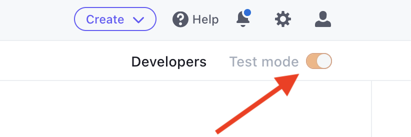
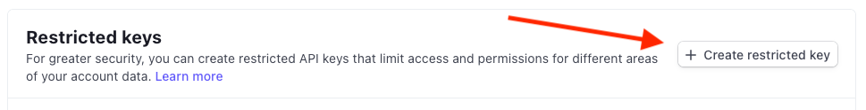
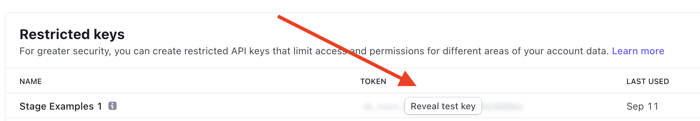
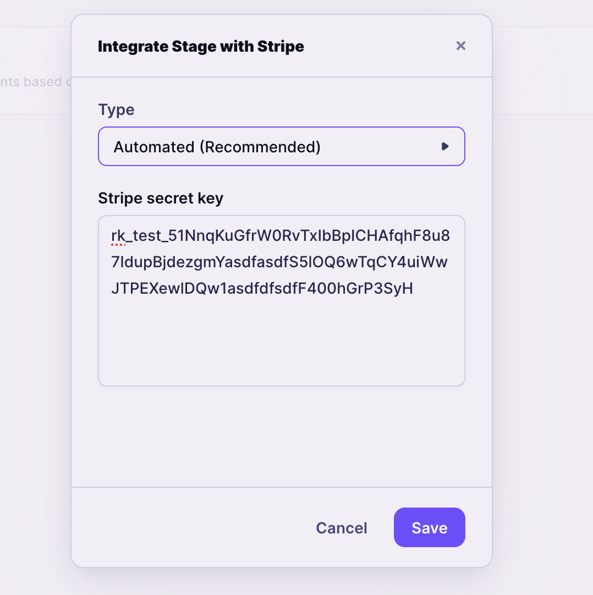
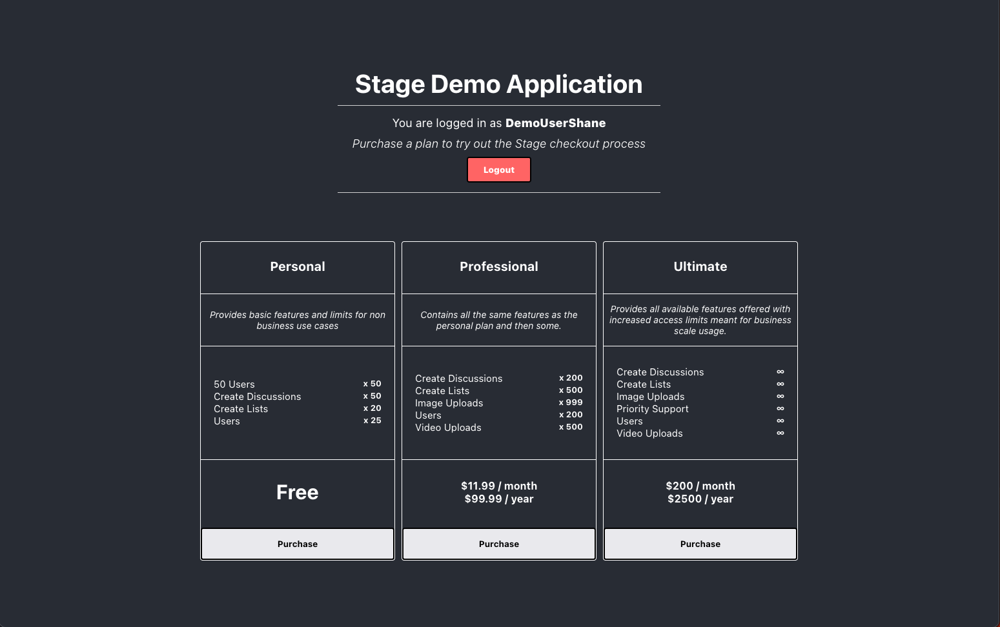
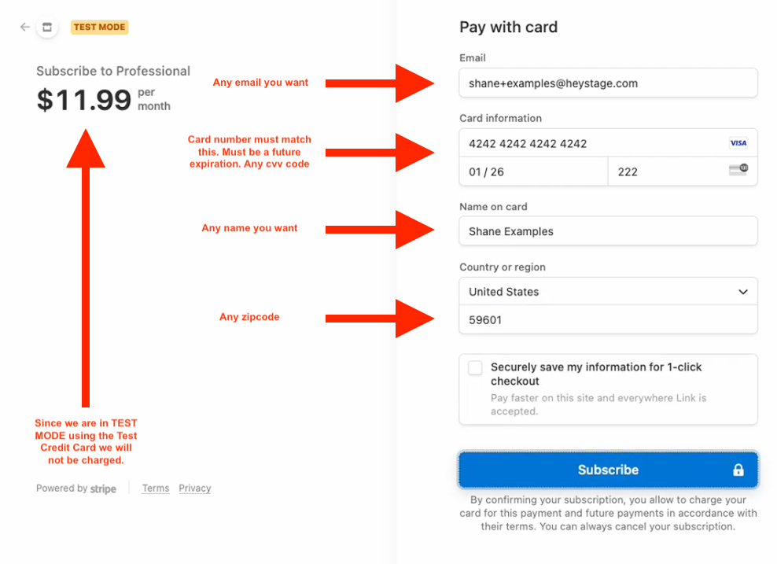

<!-- GETTING STARTED -->

## Getting Started

This is a Stage Demo Application. This application is meant to demo how easy it is to create a working Plan & Pricing page with a working Stripe checkout flow.

### Prerequisites

This demo was built using NodeJS and React. In order to run this demo application, please install the following dependencies.

- **nvm** _(used to install and manage node & npm)_
  ```sh
  curl -o- https://raw.githubusercontent.com/nvm-sh/nvm/v0.39.5/install.sh | bash
  ```
- **npm & node**
  ```sh
  nvm install --lts
  ```
  verify that npm is installed
  ```sh
  npm -v
  ```
  verify that node is installed
  ```sh
  node -v
  ```
- **A Stage account**. If you do not already have an account, please book a demo: https://www.heystage.com/book-a-demo
- **A Stripe account**. This is free, create an account here: https://stripe.com/

---

## Setup Stripe Integration with Stage

_Before we can run this demo application we'll need to integrate Stripe with our Stage Account. This is a fairly straight forward and easy process that should only take a minute or two._

1. First login to your Stripe account and toggle "Test mode" on located at the top right of the page.
<p align="center"></p>

2. Navigate to -- _Developers > API Keys_
3. At the bottom of the page you'll see **Restricted Keys**, create a new one.
<p align="center"></p>

4. Give the key a name "Stage Demo App" and give the following resources **Write** permissions.

   - Customers
   - Products
   - Checkout Sessions
   - Prices
   - Subscriptions
   - Usage Records
   - Webhook Endpoints

   At the bottom of the page click "**Create key**"

   **_These permissions are required in order to let Stage integrate and manage Stripe automatically._**

5. Add this key to your Stage account.
Click the "Reveal test key" button to view your newly created key and copy it.
<p align="center"></p>

6. Login to your Stage account: https://app.heystage.com
7. Navigate to **Developers > Integrations** page.
8. Under "Stripe for Stage" click the **Connect** button.
9. Set the Type to "Automated" and paste your Stripe restricted key into the box and **Save**
<p align="center"></p>

10. That's it. You've successfully set up Stage with Stripe _(in test mode)_.

---

### Setup the Stage Demo Application with Stage

_In order to run this Demo Application we'll need to create 2 api keys within Stage. One for our frontend client and one for the backend server that this demo uses._

1. Login to your Stage account: https://app.heystage.com
   - **1a.** _Create some plans and add features to them. This demo will only work if you have existing plans. Make sure the plans are in a "published" state. By default, new plans are put in a "draft" state._
2. Navigate to the **Developers** page.
3. Under **API Keys**, here you'll generate 2 keys.

   - Give the first key **Read** permissions.
   - Give the second key **Read & Write** permissions.

4. From the root of this repo, run following command
   ```sh
   cp client/.env.example client/.env && cp server/.env.example server/.env
   ```
5. In the `client/` directory, edit the `.env` file and set the `REACT_APP_STAGE_READ_ONLY_API_KEY` to the read-only key you created in step 3.
6. In the `server/` directory, edit the `.env` file and set the `STAGE_READ_WRITE_API_KEY` to the read-write key you created in step 3.
7. We're now ready to run the Demo Application. First we'll bring up the server with the following command.
   ```sh
   cd server && npm i && npm start
   ```
   You should see the following message
   > Server is listening on port 3001
8. Next we'll bring up the frontend, please open a new terminal and run the following command.
   ```sh
   cd client && npm i && npm start
   ```
9. That's it! Navigate to http://localhost:3000 in your browser to start using the Stage Demo Application.

Keep in mind, this demo application uses **your** Stage. You'll need to create some Plans with features and set pricing on them (whether it be free, or paid) in order for it to generate a Plan & Pricing page for you and allow you to demo the Stripe checkout process. Since this demo is using Stripe in **Test Mode** you can use Stripes fake credit card details to test the checkout process. You will not be charged anything when using Stripe in Test Mode.

---

<h2 align="center">Stage Demo Application with 3 plans configured within Stage</h2>
<p align="center"></p>

<h2 align="center">Stripe Fake Credit Card Details</h2>
<p align="center"></p>
