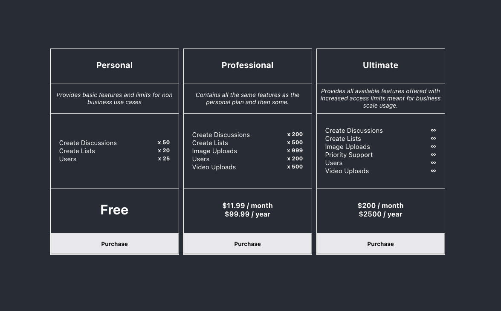

# Getting Started with React SPA Pricing Page example

To run this app you will need to copy the `.env.example` file into a new file called `.env` and replace the environment variable inside with your Stage Read-Only API key. You can create this key by logging into your Stage account and navigating to the "Developer" page.

Run this command to install the Stage Api dependency

```
npm install
```

After that you can run the project with

```
npm start
```

This sample plan and pricing page will render a page that looks similar to this.


For this example, Stage was setup with 3 plans (Personal, Professional, and Ultimate) I then created Features inside of Stage and added them to each plan. Then within each plan I gave each feature a usage limit. A usage limit of 0 is the same as not having a limit at all. Lastly I gave each plan a monthly and yearly price. For the Personal plan I left the prices empty.
